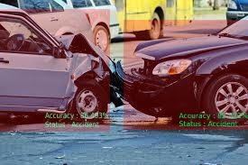

# ACCI_SAFE

It has been observed over and over again that the roads have become really unsafe. Total number of accidents in India over the last 5 years is 23,63,031. Taking into account these are the number of accidents that were actually reported. Hence we got an idea of AcciSafe is a react native mobile application that enables the user to report accidents to the nearest hospitals. The main aim is to create an ecosystem of all users registered on the app so that it is easy to identify, contact emergency people and report.
We may have noticed many times people just walk past from the accident scene to avoid inconvenience. Due to this a lot of time is wasted to inform the ambulance to arrive. Using our application anyone can just click an image of the accident, put in the vehicle number plate text and report it. Apart from the Accident Detection, it also processes the block of text to identify whether the text is related to an precautions from accidents. The system planned has following components:

------------------------------------------------------------------------------------

## 1. Client Side
     
Our system will be capable of getting the emergency contact of the user who has met with the accident, since every user while registering fill's his/her data. Apart from this it also identifies the users location and searches the nearest hospitals and notifies the selected hospital.
### Features and Details
* Secure and Fast Access
* Easy to Use
* Validation of the Image uploaded by User
* Interactable through Whatsapp
* Reward Based System for encouraging users to report
* Displays Maps and navigates user to the nearest hospital

## 2. Hospital Side
     
Here in the hospital side, the major features are to accept or reject the reports made by users a Onnd to send their ambulance's to the accident location by using the location provided in the report. Once the hospital has validated the accident report, they need to accept the request after which the reported user gets his/her credits.
### Features and Details
* Simple and Easy to Use UI.
* Extra validation of accident reports to avoid fake reports and free credits.
* Can be accessed by any hospital authority easily and is easy to understand, no learning curve involved.

## 3.	WhatsApp Interface
The system is not confined just to a mobile app. Almost all the features available on the app can also be used on the WhatsApp inteface by using reserved Keywords.
### Features and Details
* List all the nearby Hospitals to current location.
* Get Latest Accident Blogs.
* Volunteer to help a road accident victim and get the location of the nearest casuality. 

 

## 4.	Accident and Non Accident Image Classification
* **CNN Model** with an accuracy of  **93.4%** on test data.
* The Dataset used for training the CNN model can be found <a href="https://www.kaggle.com/jerrinbright/accident">here</a>

 

     
_______________________

## REPORT
* Project Proposal : <a href="https://github.com/VIHAAN-PACMan/ACCI_SAFE/blob/main/Vihaan_PAC%20Man_TeamNumber_82.pdf">Click here</a>
* Youtube link : <a href="https://www.youtube.com/watch?v=0JvfzXALwjc">Click here</a>
